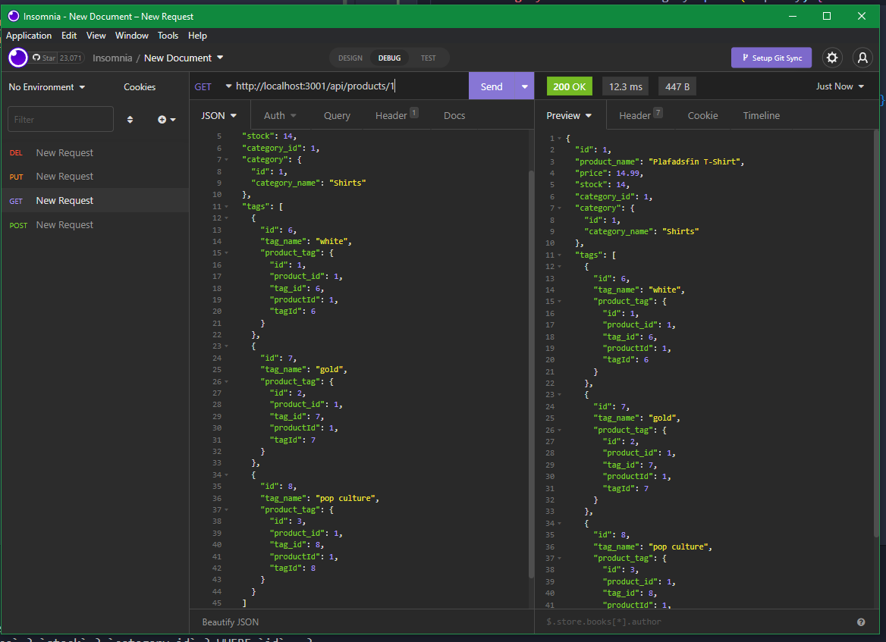
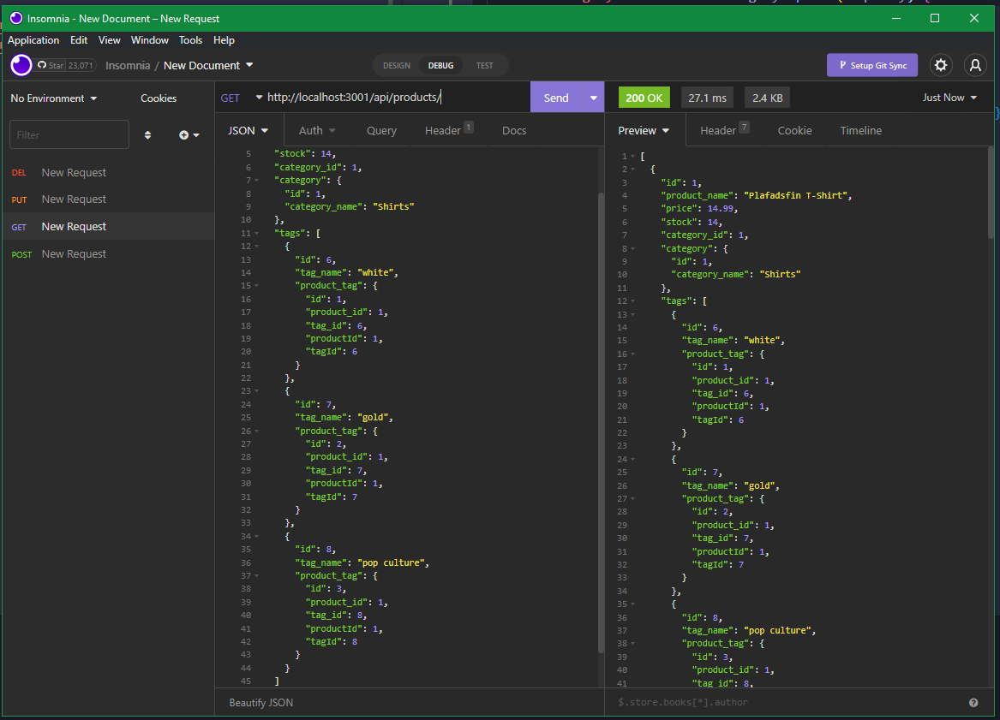

# E-commerce-Back-End-CRUD-Operations
Internet retail, also known as e-commerce, is the largest sector of the electronics industry, having generated an estimated US$29 trillion in 2017 (Source: United Nations Conference on Trade and Development). E-commerce platforms like Shopify and WooCommerce provide a suite of services to businesses of all sizes. Due to the prevalence of these platforms, developers should understand the fundamental architecture of e-commerce sites.

Given some starter code my job is to creat the models files and the routes api files. It is done when the database can be seeded and all the routes created work as intended.

